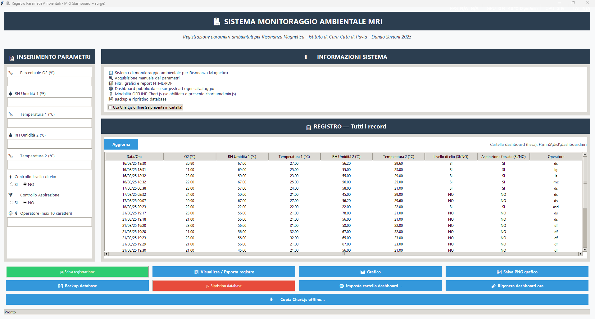

# MRI-EnvLogger

**MRI-EnvLogger** is a Python-based application designed to record, monitor, and visualize environmental parameters in the MRI suite.  
It was developed to provide radiology departments with a practical and reliable tool to document room conditions that affect image quality, patient safety, and system performance.

---

## ✨ Features
- 📊 Record and archive **temperature, humidity, oxygen, helium levels**, and other room conditions  
- ⏱ Automatic **timestamped CSV storage** for traceability  
- 🌐 Generate **interactive HTML dashboards** with Chart.js for visualization  
- 💾 **Portable and lightweight** – can run offline without complex setup  
- 🖥 User-friendly **Tkinter GUI** for quick data entry  
- 📤 One-click **backup and export** system  
- 🔧 Modular code, ready for integration with sensors, APIs, or hospital IT systems (PACS, HIS, RIS)

---

## 📌 Use Cases
- Routine documentation of MRI environmental conditions  
- Quality control and audit support  
- Sharing dashboards with colleagues via **Surge, Netlify, or GitHub Pages**  
- Training tool for radiology technicians to understand room parameters  

---

## 🛠 Technical Overview
- **Language:** Python 3  
- **GUI:** Tkinter  
- **Visualization:** Chart.js (embedded offline)  
- **Data format:** CSV with automatic timestamps  
- **Packaging:** Compatible with PyInstaller for creating standalone executables  

The project is modular and easy to extend. Developers can adapt it to interface with external sensors, network APIs, or integrate with clinical IT infrastructure.

---

## 🚀 Getting Started
1. Clone the repository:
   ```bash
   git clone https://github.com/yourusername/MRI-EnvLogger.git
